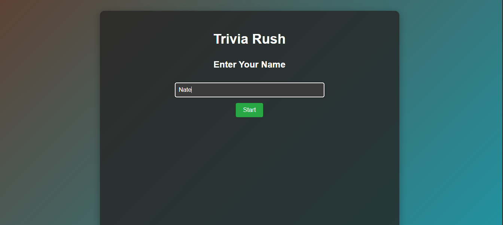
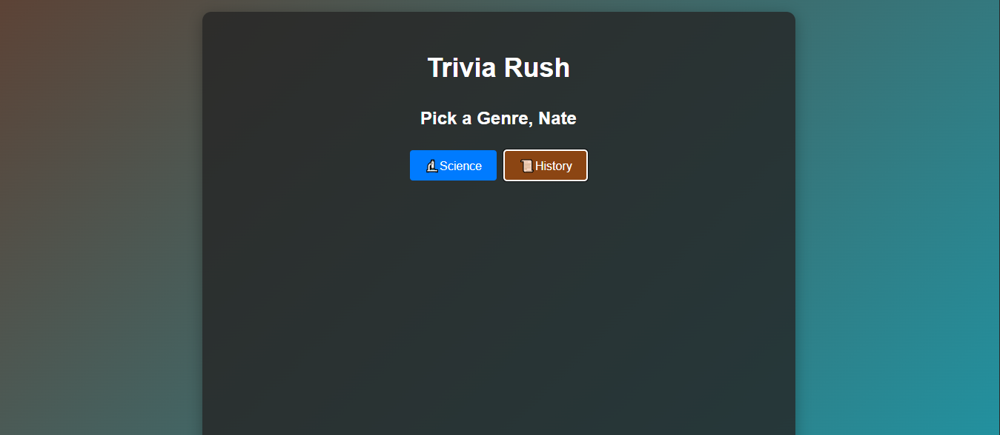
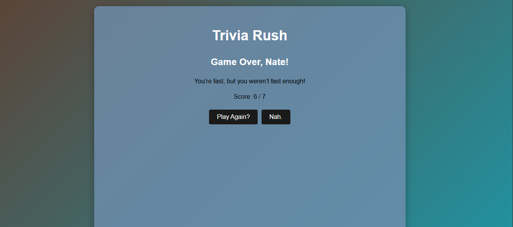

# 🎯 Trivia Rush

A fast-paced trivia game where players race against a 30-second timer to answer as many questions as possible. Test your knowledge in Science or History—how many can you get right before time runs out?

## 🚀 Live Demo

https://nate-trivia.netlify.app

## 📸 Screenshots

 ### Start Screen
   

### Genre Select
   

### Gameplay
   

 ### Results
   

## ✨ Features

- **Two Genre Categories**: Choose between Science 🔬 or History 📜
- **30-Second Challenge**: Race against the clock to answer questions
- **Dynamic Theming**: Genre-specific color schemes for an immersive experience
- **Personalized Experience**: Enter your name for a customized gameplay
- **Randomized Questions**: Questions shuffle each game for replay value
- **Score Tracking**: See how many questions you answered correctly
- **Special Win Condition**: Answer all questions within 30 seconds for a legendary finish
- **Smooth Animations**: Fade-in transitions for a polished user experience

## 🛠️ Built With

- **React** - Frontend framework
- **Vite** - Build tool and dev server
- **CSS3** - Styling and animations
- **JavaScript (ES6+)** - Game logic

## 🎮 How to Play

1. Enter your name on the welcome screen
2. Select your preferred genre (Science or History)
3. Read the "Get Ready" prompt
4. Answer as many questions as possible in 30 seconds
5. Click any answer option to submit and move to the next question
6. Try to beat the clock and answer all questions!

## 💻 Installation & Setup

### Prerequisites
- Node.js (v14 or higher)
- npm or yarn

### Steps

1. **Clone the repository**
   ```bash
   git clone https://github.com/Nateliso/trivia-game.git
   cd quiz-game
   ```

2. **Install dependencies**
   ```bash
   npm install
   ```

3. **Run the development server**
   ```bash
   npm run dev
   ```

4. **Open in browser**
   ```
   Navigate to http://localhost:5173
   ```

## 📁 Project Structure

```
trivia-rush/
├── src/
│   ├── App.jsx          # Main game component
│   ├── App.css          # Styling
│   └── main.jsx         # Entry point
├── public/
├── package.json
└── README.md
```

## 🎨 Game Mechanics

- **Timer**: 30 seconds countdown starts after genre selection
- **Questions**: 15 pre-loaded questions per genre
- **Scoring**: +1 point for each correct answer
- **Win Condition**: Answer all questions before time expires
- **Game Over**: Triggered when timer reaches 0 or all questions answered

## 🌈 Genre Themes

### Science Theme
- Background: Slate Blue
- Button Color: Ocean Blue
- Dark text for readability

### History Theme
- Background: Rich Brown
- Button Color: Tan/Beige
- Light text for vintage feel

## 🔮 Future Enhancements

- [ ] Add more question categories (Geography, Sports, Entertainment)
- [ ] Implement difficulty levels (Easy, Medium, Hard)
- [ ] Create a leaderboard system
- [ ] Add sound effects and background music
- [ ] Integrate external trivia API for unlimited questions
- [ ] Add multiplayer mode
- [ ] Track personal best scores with local storage

## 👤 Author

**Your Name**
- GitHub: [@Nateliso](https://github.com/Nateliso)
- LinkedIn: [liso-mhlana](https://linkedin.com/in/liso-mhlana-dev)

## 🙏 Acknowledgments

- Questions curated for educational and entertainment purposes
- Inspired by classic trivia games and speed quiz formats

---

⭐ If you enjoyed this project, give it a star on GitHub!